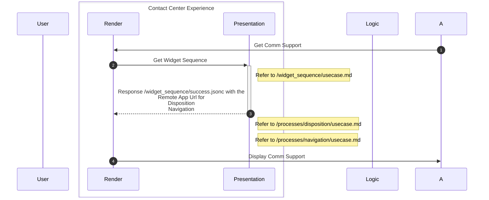

```mermaid
sequenceDiagram
	autonumber
	participant U as User
    participant R as Render
    participant P as Presentation
    participant L as Logic

	box Contact Center Experience
		participant R as Render
		participant P as Presentation
	end
	A ->> R: Get Comm Support

	R ->>+ P: Get Widget Sequence
	Note Right of P: Refer to /widget_sequence/usecase.md
	P -->>- R: Response /widget_sequence/success.jsonc with the <br>Remote App Url for<br> Disposition<br>Navigation
	Note Right of P: Refer to /processes/disposition/usecase.md
	Note Right of P: Refer to /processes/navigation/usecase.md

	R ->> A: Display Comm Support
```